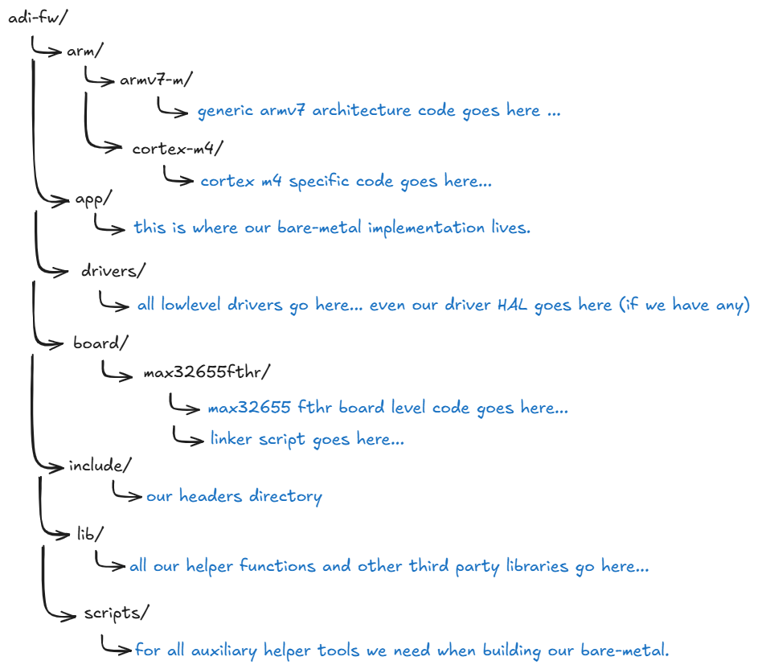
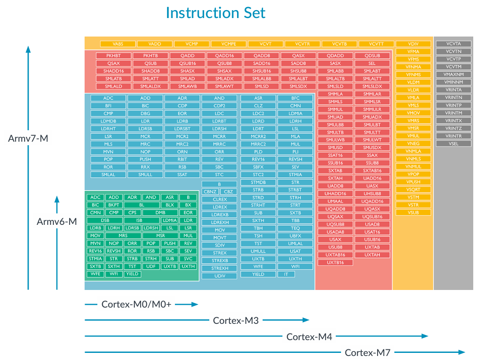

# Directory Layout

> _"Every great work begins with a plan."_ - Urza Planeswalker

Our bare metal firmware is going to be laid out in simple and straight forward
manner. Will we consider abstraction and high level concepts like design patterns?
Probably. Sure why not? But they are not what this journey is about. 

## What directories will we have?

What are the component blocks that a typical bare metal source tree would have?

+ The build system (comprising of the Makefiles and other scripts)
+ The architecture specific directory that categorizes all the architecture 
specific code from the rest.
+ In most cases, libc which will provide some very common library functions we
will constantly need as well essential POSIX stubs to make functions like
malloc() work.
+ The board directory where we need to implement board level logic. 
This is also where our firmware will get built.
+ The main bare-metal (application layer) directory sources.
+ The driver directory which will contain all our drivers.
+ A Libraries directory for when we need to add certain features and implementation.
Our utilities like linked-list implementations, checksums, endian conversions, etc. 
will also be placed here. our libc stubs will also go here.
+ Lastly, a headers or include directory where we stuff all our headers in.

Roughly, our adi bare-metal firmware directory would look something like this.



There would probably be more depending on use cases, but this would provide us
with a good start on things. We can always go back and add and re-arrange them 
all later anyway.

Let's think about how this layout came to be in the next few paragraphs.

## Max32655 and the ARM architecture heirarchy

As said before, we will be using the Max32655 FTHR board for our bare-metal
firmware development. This small development kit according to its 
[product brief](https://www.analog.com/en/resources/evaluation-hardware-and-software/evaluation-boards-kits/max32655fthr.html#eb-overview)
uses the Max32655 Microcontoller. We head over to the Max32655 
[product brief](https://www.analog.com/en/products/max32655.html) and we see
that it has an Arm[^1] Cortex-M4F CPU as its core.

The Arm platform follows a structured-layered heirarchy that separates three things,

+ Instruction Sets
+ CPU Implementations
+ System Integration

### Instruction Sets
At the lowest software visible level, we have the ISA or instruction set
architecture that defines machine instructions, register model, exception model,
priviledge levels, and memory access rules. This is where we can see the following 
naming convention:

+ ARMv6-M
+ ARMv7-M
+ ARMv7-A
+ ARMv8-A
+ ARMv8-M
+ ARMv9-A

### Architecture Profiles
Arm groups Instruction set architectures into profiles based on intended use.

+ A is for application purposes like Linux/Android.
+ R is for real-time where it is used in automotive and safety critical systems.
+ M is for Microcontroller (embedded)

### CPU Core Implementations
A CPU core is a concrete implementation of an ISA and takes the form:
```
Cortex-[Profile][Number][Variant]
```

Cortex is really just branding in and of itself similar to how AMD its Ryzen CPUs
and Intel has their own Core i5, i7. So in the case of Max32655, the Cortex-M4F
according to the it's Arm [Technical Reference Manual](../resources/arm/arm_cortexm4_processor_trm_100166_0001_04_en.pdf)
is a CPU that uses the [Armv7](../resources/arm/DDI0403E_e_armv7m_arm.pdf) ISA,
targeted for embedded platforms, 4 is the product tier / feature class and then
the `F` means it has a floating point unit functionality included. This will
become apparent later when we are choosing the proper compiler flags to
generate compatible code for Max32655 MCU.

The additional table below shows the difference between different Cortex-M tiers.



### System-On-Chip and Max32655
Arm does not sell chips. It sells CPU IP. Semiconductor vendors take an Arm core
and build major system components and pripherals around it then sell them as 
System-On-Chips. This is where MCUs like Max32655 comes in. The Max32655 contains,
on a single chip:
+ Cortex-M4F CPU Core
+ Flash Memory
+ SRAM 
+ GPIO
+ Analog Inputs and Outputs
+ UART/SPI/IIC/BLE
+ Timers
+ DMA
+ Power Management
+ Security Blocks

### The board
We have no reached the highest heirarchy of our hardware which is the board. 
A board is a physical platform that makes the MCU (SoC) usable in a system. 
It has the circuitry needed to make the MCU peripherals interact to world at 
large.

### Going back to the bare-metal directory layout 
For now, we are not interested in supporting any other MCU other than Max32655.
Thus, our chosen directory layout for all MCU related plus the board is as 
follows:

```
adi-fw/
  |
  +---- arm/        
  |      |
  |      +----- armv7-m/
  |      |
  |      +----- cortex-m4/
  |
  +---- board/
         |
         +----- max32655fthr/
         |
         +----- otherboard/
```

The board/ directory will house all the boards which use the Max32655 MCU. 
For now, we only have our fthr board.

## The Next Step
In the [next step](../02_Build_System/README.md), we will study how to approach 
making the initial Makefile of our bare-metal firmware. We will look into some
details of the GNU Make [Manual](../resources/gnu/make.pdf) tool, as well as
some [GCC](../resources/gnu/gcc.pdf) compiler flags that will be relevant in
the build process.

[^1]: Arm used to be written as all-caps ARM since it started as an acronym for
Acorn RISC Machine.

