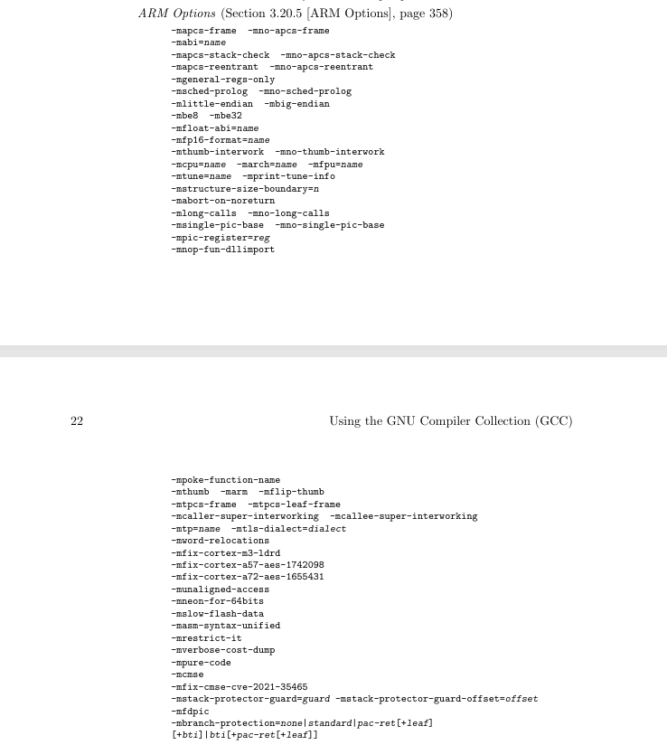

# Arm Makefile Fragment
As our project begins to target a specific architecture, it is important to
separate the configuration related to the toolchain from the rest of the build
system. In this section, we introduce an Arm-specific makefile fragment, which
defines the compiler, assembler, linker and associated flags required to
build firmware for our chosen target platform.

Keeping these settings in a dedicated fragment improves the structure and 
maintainability of the build system. Rather than scattering architecture-specific
configuration throughout the project, the Arm toolchain details are centralized
in one place. This makes the build easier to understand, easier to modify for
different targets, and simpler to reuse in future projects that rely on the
same toolchain.

## Review Our MCU Datasheet Once again
So we are developing a baremetal firmware that will run on
[Max32655Fthr](../resources/datasheets/MAX32655FTHR.pdf) evaluation kit. We
realize that this evaluation kit has a Max32655 [MCU](../resources/datasheets/max32655.pdf)
which in turn has an Arm [Cortex-M4F](../resources/arm/arm_cortexm4_processor_trm_100166_0001_04_en.pdf)
microcontroller.

From the datasheet, we learn that the [Arm Cortex-M4F](../resources/arm/arm_cortexm4_processor_trm_100166_0001_04_en.pdf)
is built on top of an [Armv7E-M](../resources/arm/DDI0403E_e_armv7m_arm.pdf)
architecture.

## Match ARM Details to Compiler Flags

A good way to approach this is to skim through the GCC [manual](../resources/gnu/gcc.pdf)
and look for sections pertaining to Arm. The illustration below gives us 
exactly that.



We can see a few notable flags from first glance (really?) Let's go over what 
each of them does.

### -march=name
**`-march=name`** specificies the name of the target Arm architecture. GCC uses
this name to determine what kind of instructions it can emit when generating
assembly code. This option can be used in conjunction with or instead of the
`-mcpu=` option.

Valid names are: `armv4t`,`armv5t`, `armv5te`, `armv6`, `armv6j`, `armv6k`,
`armv6kz`, `armv6t2`, `armv6z`, `armv6zk`, `armv7`, `armv7-a`, `armv7ve`, 
`armv8-a`, `armv8.1-a`, `armv8.2-a`, `armv8.3-a`, `armv8.4-a`, `armv8.5-a`,
`armv8.6-a`, `armv9-a`, `armv7-r`, `armv8-r`, `armv6-m`, `armv6s-m`, `armv7-m`,
`armv7e-m`, `armv8-m.base`, `armv8-m.main`, `armv8.1-m.main`, `iwmmxt`,
`iwmmxt2`.

Now if we have been paying attention, we would remember that our Arm 
architecture is _"Arm7E-M"_, but in our `adi-fw/arm` directory, we only have
`armv7-m`. So for now, let us just keep things as generic as possible and use
_"armv7-m"_.

> [!NOTE]
> The `name` parameter also supports a `+extension` format where, depending
on the architecture, can be appended to add more capabilities to the Arm
architecture we are targetting. But that is outside the scope of this tutorial
for now.

### -mtune=name
**`-mtune=name`** option specifies the name of the  target Arm processor for
which GCC should tune the performance of the code. _For some Arm implementations
better performance can be obtained by using this option_.

There are a few valid names we can choose, I won't put all the valid names here
anymore for brevity. But we know we will be using `cortex-m4` for `-mtune`.

### -mcpu=name
**`-mcpu=name`** specifies the name of the target Arm processor. GCC uses
this name to derive the name of the target Arm architecture (as if specified by 
-march) and the Arm processor type for which to tune performance (as if 
specified by `-mtune`). Where this option is used in conjunction with `-march`
or `-mtune`, those options take precedence over the appropriate part of this
option.

> [!WARNING] 
> So now we have a little issue, it seems that one `-mcpu=cortex-m4` is much 
better that having both `-march=armv7-m -mtune=cortex-m4` yet these two has
precedence over `-mcpu`. We really won't care too much about those little 
things for now. let's drop `-mcpu` usage for now and move on.

### Enable Thumb Mode Instructions
**`-mthumb`** option tells GCC to generate code that executes in **Thumb** 
state. The default for all configuration is to generate code that executes in
Arm state, but we need to override it to emit **Thumb** code instead. 

### Floating Point Support
**`-mfpu=name`** specifies what floating point hardware (or hardware 
emulation) is available on the target. First, let us review what floating point
hardware is available in our MCU.

> [!NOTE]
> Section A2.5 of the Armv7-M [manual](../resources/arm/DDI0403E_e_armv7m_arm.pdf)
talks about the optional floating point extensions available. Two versions
are avaiable `FPv4-SP` and `FPv5.

The GCC [manual](../resources/gnu/gcc.pdf) lists a few permissible values we
can use for `-mfpu`. From this list we can see that `fpv4-sp-d16` is the
closest option for our Max32655 mcu.

One thing to note here is that `-mfpu` only tells the GCC compiler what FPU
hardware is available. 

**`-mfloat-abi=name`** specifies which floating-point ABI to use. Permissible
values are `soft`, `softfp` or `hard`. Specifying `soft` causes GCC to generate
output containing library calls for floating-point operations. A direct effect
of this is enlarged binary size since the compiler will need to pull in and 
statically link floating point libraries. `softfp` is a combination of both
software calling conventions and hardware floating point instructions. Lastly,
`hard` will generate native instructions when working with floating points

So what options do we need to choose for supporting floating point? The honest 
answer is that we don't usually need to support floats. **Avoid floating points
unless there is a clear benefit.**

### Let's Put it All Together Now
Let's edit our `arm/armv7-m/arch.mk` now to add Armv7-M specific flags.
```Makefile
CFLAGS+=-march=armv7-m -mthumb
```
Also edit `arm/cortex-m4/cpu.mk` to add Cortex-M4 specific tuning.
```Makefile
CFLAGS+=-mtune=cortex-m4
```

## Next Steps
We have explored the thought process on how to add architecture specific 
`CFLAGS` to our baremetal project. In the [next step](../04_Linker_Script_and_Memory_Layout/README.md),
let us explore firmware sections and how to bend them to our will using linker
directives.
