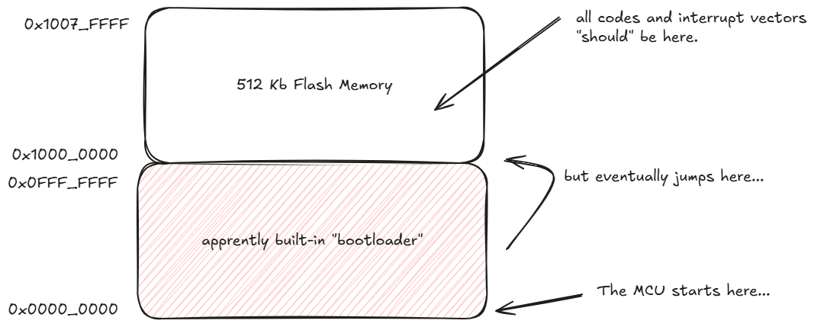
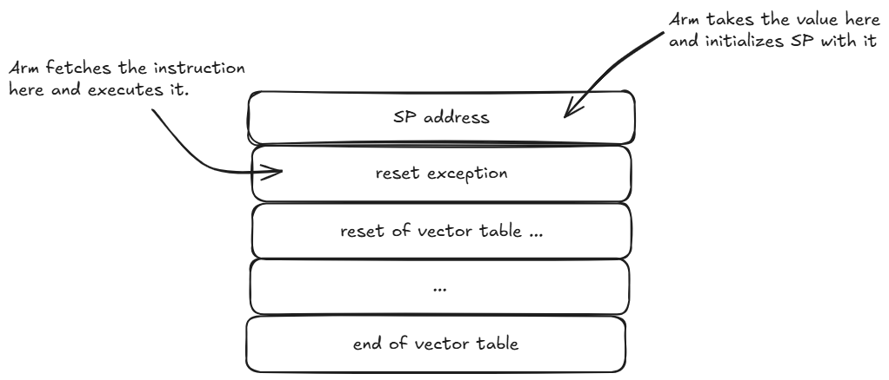
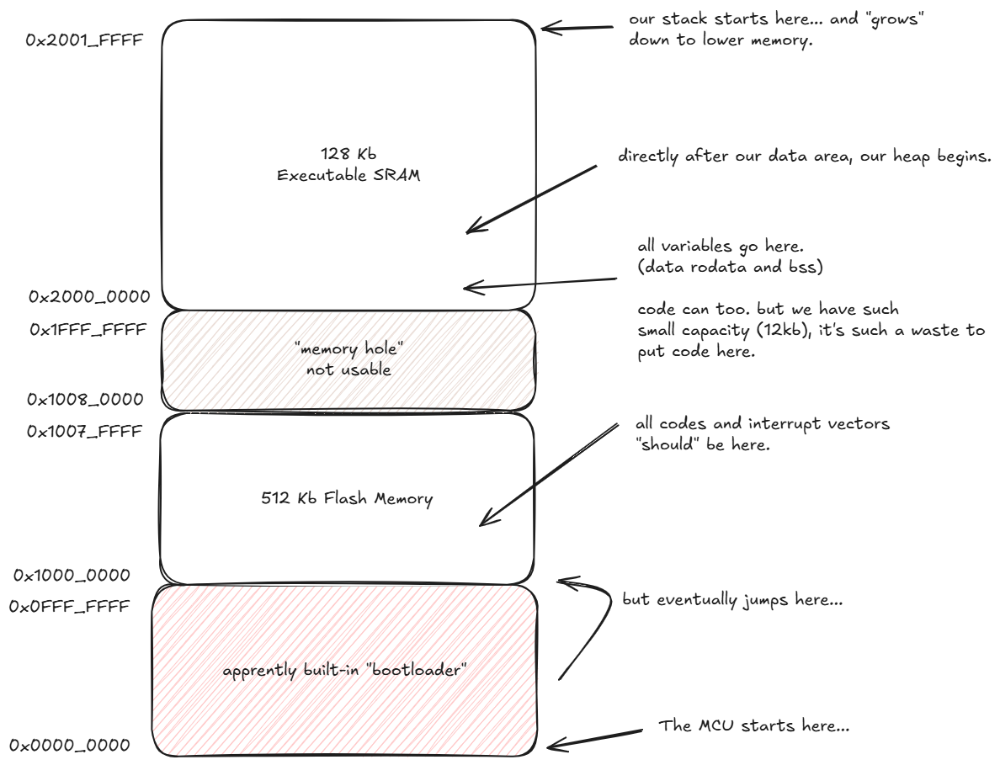
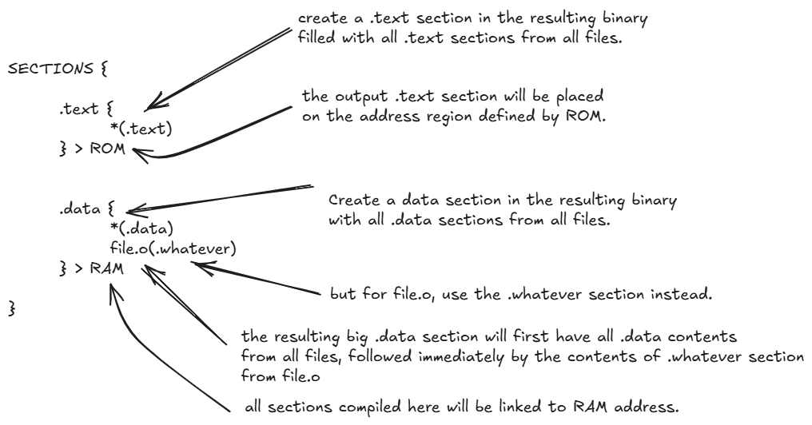

# Linker Script and Memory Layout
Firmware is not merely a collection of source files, but a structured program
image that must be precisely arranged within the memory map where it is 
executed. Every instruction, variable, and constant ultimately resides at a 
specific location within the processor's address space.

To manage this arrangement, firmware is traditionally organized into well-defined
sections. These sections correspond closely to the underlying memory layout
of the device, enabling the linker the place each component of the program 
in the appropriate region of flash or RAM.

Understanding this relationship between firmware sections and the address space
is fundamental, as it explains how high-level program constructs are translated
into a concrete memory organization that the processor can execute and access
at runtime.

## What Exactly Do We Mean By "Linking"?
When you wrote your first _"Hello, World!"_ program in C, you might have marveled
at the apparent magic happening behind the scenes (maybe not). There you were
typing `printf("Hello, World!");` into a text file, running a compiler, and 
somehow, the resulting executable knew exactly where to find both the string
_"Hello, World"_, and the `printf()` function itself when the program ran.

But how could this be? Your source code contained no memory addreses, no 
explicit instructions about where these pieces should live in RAM, yet when ran,
your program confidently reached into memory at precisely the right locations
to retrieve the string and execute the printing function. This seemingly simple 
question - _"How does the program know where everything is?"_ - lives at the 
core of executable creation: **linking**.

The answer lies in understanding that compilation and linking are distinct phases
or program creation. When the compiler processes your "Hello, World!" code, it
generates object code that contains placeholders - symbolic references that 
essentially say "there is a string in here that I'll need later" and "there's a
function call to something called `printf` that I'll need to resolve eventually".

The actual assignment of memory address and the resolution of these symbolic 
references happens during the linking phase, where the linker takes your compiled 
object file, combines it with the standard C library (which contains the actual
`printf()` implementation), and stitches everything together into a executable
that knows exactly where everything lives in memory.

There is an insight that needs to be understood here which is: **Symbol vs
Address distinction**: Your brain (and by extension your source code) works with
symbolic names (`printf`, "Hello, World!"), but the CPU needs concrete memory
addresses - linking bridges this gap.

**Among many other things**, linkers perform what is called _"Symbol Resolution"_.
References among many objects and programs, are made using symbols: i.e. your 
program might use some function called `sqrt`, and another object file (or 
math library) defines `sqrt`. The linker resolves the symbol by noting the 
object's location assigned to `sqrt` in the math library **and patching** your 
program's object code so the call to `sqrt` resolves to that location.


## Program Sections
The compiler generates object code and groups them together according to their
shared purpose. For example, all global variables go into one general location,
all executable (e.g. machine instructions) go into another region. **Sections**
are distinct regions within object files and executable files that group related
data or code together based on their characteristics and intended purpose
during program execution.

Let us explore some standard section types on a real no-OS bare-metal firmware.

1. First, head on over to no-OS [releases](https://github.com/analogdevicesinc/no-OS/releases/tag/last_commit)
and download a firmware of your choice. In my case I'm going to download the 
firmware called `adalm-mmsc`.
```Bash
$ wget https://github.com/analogdevicesinc/no-OS/releases/download/last_commit/adalm-mmsc.zip
```

2. Let's extract the firmware ELF file inside the adalm-mmsc zip archive.
```Bash
$ unzip adalm-lsmspg.zip *.elf
Archive:  adalm-mmsc.zip
  inflating: adalm-mmsc_maxim_iio_example_max32665.elf
```

3. Using a tool called `readelf` let us now print the program sections.
```Bash
$ arm-none-eabi-readelf -S adalm-mmsc_maxim_iio_example_max32665.elf
There are 22 section headers, starting at offset 0x18fdb8:

Section Headers:
  [Nr] Name              Type            Addr     Off    Size   ES Flg Lk Inf Al
  [ 0]                   NULL            00000000 000000 000000 00      0   0  0
  [ 1] .text             PROGBITS        10000000 010000 01fee0 00  AX  0   0 64
  [ 2] .ARM.exidx        ARM_EXIDX       1001fee0 02fee0 000008 00  AL  1   0  4
  [ 3] .data             PROGBITS        20000000 030000 0015f4 00  WA  0   0  8
  [ 4] .pal_nvm_db       PROGBITS        10100000 0315f4 000000 00   W  0   0  1
  [ 5] .bss              NOBITS          200015f8 0315f8 011918 00  WA  0   0  8
  [ 6] .heap             PROGBITS        20012f10 0315f8 000c00 00      0   0  8
  [ 7] .ARM.attributes   ARM_ATTRIBUTES  00000000 0321f8 000030 00      0   0  1
  [ 8] .comment          PROGBITS        00000000 032228 000033 01  MS  0   0  1
  [ 9] .stack            PROGBITS        00000000 032260 001000 00      0   0  8
  [10] .debug_info       PROGBITS        00000000 033260 064645 00      0   0  1
  [11] .debug_abbrev     PROGBITS        00000000 0978a5 01162e 00      0   0  1
  [12] .debug_aranges    PROGBITS        00000000 0a8ed8 002dd8 00      0   0  8
  [13] .debug_ranges     PROGBITS        00000000 0abcb0 0035d8 00      0   0  1
  [14] .debug_macro      PROGBITS        00000000 0af288 0119b9 00      0   0  1
  [15] .debug_line       PROGBITS        00000000 0c0c41 0361c0 00      0   0  1
  [16] .debug_str        PROGBITS        00000000 0f6e01 059fdc 01  MS  0   0  1
  [17] .debug_frame      PROGBITS        00000000 150de0 00ab80 00      0   0  4
  [18] .debug_loc        PROGBITS        00000000 15b960 025547 00      0   0  1
  [19] .symtab           SYMTAB          00000000 180ea8 00a510 10     20 1870  4
  [20] .strtab           STRTAB          00000000 18b3b8 004922 00      0   0  1
  [21] .shstrtab         STRTAB          00000000 18fcda 0000dc 00      0   0  1
Key to Flags:
  W (write), A (alloc), X (execute), M (merge), S (strings), I (info),
  L (link order), O (extra OS processing required), G (group), T (TLS),
  C (compressed), x (unknown), o (OS specific), E (exclude),
  D (mbind), y (purecode), p (processor specific)
```

**A few notable observations from this report:**

+ A section called `.text` which has the `AX` flags.
+ A `.data` section with the 'WA' flags.
+ A `.bss` section with the same flags as `.data.`
+ A `.heap` section that is only 0xc00 big and has no flags.
+ A `.stack` section that is 0x1000 and also has no flags like `.heap`
+ A couple of debug sections are included (`.debug_xxx`)
+ Sections for symbols(`.symtab`) and strings (`.strtab` & `shstrtab`).

There is however the glaring absence of `.rodata` anywhere which means this 
firmware does not make use of `const` global variables.

In a bare-metal environment like ours where there are no complicated virtual 
memory setup, the ELF flags don't really hold much water. But we can still
see the intended purpose. `.text` is marked `AX`, `X` means executable. `.data`
and `.bss` are both marked `AW`, which is usually the case for variables in RAM.

A more in-depth exploration of the ELF standard and sections can be found in
this [writeup](../writeups/ELF.md).

#### Formal Introduction to Standard Sections
ELF is a relatively new binary format. The OG format for unix back then used 
to be called _"a.out"_ before it was standardized to ELF. `a.out` according to 
some sources stands for _"assembler out"_. The `a.out` was the first to define
all these standard sections we are using today. There was really no formal
document for `a.out`, instead it was loosely defined by the Unix source code 
itself and a few old UNIX [documents](../resources/standards/unix_programmers_manual.pdf).

> [!NOTE] 
> Section 3 Segments of the [Unix Programmer's Manual](../resources/standards/unix_programmers_manual.pdf)
gives us the traditional (and long standing) definitions of the three original 
standard segments.

> Assembled code and data falls into three segments: the *text* segment, the 
*data* segment, and the *bss* segment. *text* segment is the one in which the 
assembler begins, and it is the one into which instructions are typically 
placed. 

Functions will get allocated and assigned a location within the text segment. 
Let's confirm this with our `adalm-mmsc.elf`. Let's pick a sureball function
name like `main`.

```Bash
$ arm-none-eabi-nm adalm-mmsc_maxim_iio_example_max32665.elf  | grep main
1000fa4c T iio_example_main
1000fcec T main
```
The `T` is already a good indicator that it is in the `.text` section, but we
can also cross check as well with our `readelf` report.
```Bash
  [ 1] .text             PROGBITS        10000000 010000 01fee0 00  AX  0   0 64
```
`iio_example_main` is located at `0x1000fa4c` and `main` is at `0x1000fcec`,
both are within the reported memory boundary of `.text` (`10000000` - `10010000`).

> The *data segment* is available for placing data or instructions which will be
modified during execution. Anything which may go into text segment may be put
into the data segment.

Let's run some experiments on our `adalm-mmsc.elf` firmware.

```bash
$ arm-none-eabi-nm adalm-mmsc_maxim_iio_example_max32665.elf  | grep ' [Dd] '
20000000 D SystemCoreClock
200015f4 D __TMC_END__
200015f0 d __do_global_dtors_aux_fini_array_entry
200015f4 d __fini_array_end
200015f0 d __fini_array_start
200015ec d __frame_dummy_init_array_entry
2000147c D __global_locale
200015f0 d __init_array_end
200015e8 d __init_array_start
20001068 D __malloc_av_
20001470 D __malloc_sbrk_base
20001474 D __malloc_trim_threshold
200015e8 d __preinit_array_end
200015e8 d __preinit_array_start
20000000 D _data
200015f4 D _edata
200004bc d _events
20000c38 D _impure_ptr
20000004 d _state
20000020 d _state
200005c8 d acm_cfg
20000498 d ad4080_ch
20000134 d ad4080_ch_attr
20000184 d ad4080_global_attr
20000490 d ad4080_scan_type
20000be0 d adalm_mmsc_iio_ctx.0
20000ab0 D afe_ctrl_init_param
200000cc d afe_stat
200000d4 d attr_handlers
200009fc d attr_types_strs
20000c1c D cfg_spi_extra
20000b70 D cfg_spi_init_param
20000b5c D cfg_ss_init_param
20000a0c d cmds
20000538 D config_descriptor
20000c08 D data_spi_extra
20000b3c D data_spi_init_param
20000b28 D data_ss_init_param
20000098 d decimation_factor
20000bac d default_ad4080_init_param
200009f8 d delim
20000524 D device_descriptor
2000002c d fifo_mode
2000003c d fifo_status
20000088 d filter_select
2000005c d func_str
20000b00 D gate_ctrl_q1_init_param
20000aec D gate_ctrl_q2_init_param
20000ad8 D gate_ctrl_q3_init_param
20000ac4 D gate_ctrl_q4_init_param
20000b14 D gp3_init_param
200005d4 d header
200009ec d header_end
20000bd0 D heartbeat_callback
20000c30 D iio_uart_extra
20000c40 d impure_data
20000054 d io_str
2000057c D lang_id_desc
20000a9c D led_ctrl_init_param
2000000c d line_coding
20000c34 D max_gpio_extra
20000580 D mfg_id_desc
20000014 d notify_data
20001478 d numempty
200000c0 d operating_modes
20000028 d overflows
200005a4 D prod_id_desc
20000044 d threshold_event_status
20000a7c D timer_init_param
20000a90 D timer_irq_ip
20000b90 D uart_init_param
```

The listed variables shown above are all defined and initialized variables 
which we can cross check with the repository for adalm-mmsc [project](https://github.com/analogdevicesinc/no-OS/tree/main/projects/adalm-mmsc).

> The *bss segment* may not contain any explicitly initialized code or data. 
The segment bss is actually and extension of the data segment and begins
immediately after it. At the start of the execution of a program, **the bss 
segment is set to 0**.

Let's run some experiments again on our `adalm-mmsc.elf` firmware.
```Bash
$ arm-none-eabi-nm adalm-mmsc_maxim_iio_example_max32665.elf  | grep ' [Bb] '
200016dc b BREAK_signal
200016d8 b DTE_present
20001618 b MXC_USB_Request
20001da4 b RxAsyncRequests
20001d98 b TxAsyncRequests
2008c000 B __StackTop
2008c000 B __StackTop_Core1
20012edc B __malloc_current_mallinfo
20012f04 B __malloc_max_sbrked_mem
20012f08 B __malloc_max_total_mem
20012ed8 B __malloc_top_pad
200015f8 B _bss
20012f10 B _ebss
20001e18 b _system_ticks
20002ec4 b adc_buffer
20001690 b callback
20001920 b callback
20001938 b callback
20001b10 b callback
20001970 b callback_getdescriptor
20001d94 b cbFunc
20001c10 b cbparam
20001934 b chained_cbdata
20001930 b chained_func
200015f8 b completed.1
20001974 b config_value
20001ea0 b configured
200016e4 b creq
20012ec8 b ctr.2
20001d90 b ctrl_save
200019c8 b device_status
20001b0c b dma_lock
200019cc b dma_resource
2000167c b driver_opts
20001d8c b endtick
20001978 b enum_data
200019a0 B enum_desc_table
2000197c b enum_req
20001648 b ep_size
20012f0c B errno
20001ea8 b event_flags
2000168c b events
20002eb4 b gate_ctrl_q1
20002eb8 b gate_ctrl_q2
20002ebc b gate_ctrl_q3
20002ec0 b gate_ctrl_q4
20001e9c b guart
20001614 b heap_end
200016e3 b if_num
200016e1 b in_ep
20001d10 b initialized
20001e30 b last_slave_id.0
20001e24 b last_slave_id.1
20012ecc B led_ctrl
20012ed0 b led_irq_ctrl
200016e2 b notify_ep
200018fc b nreq
20001e20 b nvic
200015fc b object.0
200016e0 b out_ep
20001868 b rbuf
20001eac b remote_wake_en
20001828 b repbuf
200018ec b rfifo
20001804 b rreq
20001800 b rreq_complete
20012ec4 b s.3
20001678 b setup_phase
20001db0 b spi_table
20001d14 b states
20001ea4 b suspended
20012ed4 b timer_desc
20001dd4 b timer_mutex_table
20001eb4 b uart_buff
20001e3c B uart_irq_state
20001de8 b uart_mutex_table
20001eb0 b usb_read_complete
2000176c b wbuf
2000172c b wepbuf
200017f0 b wfifo
20001708 b wreq
```
All of these variables are defined in the adalm-mmsc project source code 
somewhere but are not initialized. Some like `gate_ctrl_qX` are initialized to
`NULL` but since NULL is assumed `0` and `.bss` is cleared to zero anyway 
early during startup. The compiler just optimized and placed them in the `.bss`
section. For cross checking, head over to thee adalm-mmsc [project](https://github.com/analogdevicesinc/no-OS/tree/main/projects/adalm-mmsc) 
repository.

> [!NOTE]
> An important realization here is that since uninitialized variables are only
given values during runtime, they should not take up space in the binary image.
They are allocated space in memory yes, but since they don't start with any 
default value, they do not take up space in the binary image itself. A source 
code with lots of initialized global variables will produce a larger binary 
versus a code with lesser initialized global variables.

## Linker Directives
If linker is the worker, then linker directive is the blueprint. Linker 
directives give the linker exact instructions on how to link and emit a binary.
We will use the [GNU ld linker](../resources/gnu/ld.pdf) in our baremetal project.


## Reviewing the Address Space of Max32655
Take a look at chapter Max32655 [user guide](../resources/datasheets/max32655-user-guide.pdf).
Specifically, the memory map (hint: memory maps are usually presented as an 
overview-type information and is placed at the first few pages or chapters of
user manuals).

~[](../resources/images/arm_gcc_options.png)

From the memory map, we now have an idea of where our firmware binary image 
will be stored. And where code and variables will go. Let's go through our 
usual train of thought again regarding this.

### Starting our Linker Directive

#### Firmware Image Storage and Entry Point
In embedded systems, firmware binaries are always stored in non-volatile
memories. The program must survive power loss. At system startup, the processor
begins execution from a predefined address known as the **reset vector**. The
memory mapped at this location must already contain valid instructions;
otherwise, the processor would have no program to execute. Non-volatile memories
satisfy this requirement because they retain their contents even without power.

It is for this reason that we should make sure that our firmware's first 
instruction is "linked" and also flashed at the reset vector.

Let us inspect once again the non-volatile portion of the Max32655 memory map
and also a little bit about the reset vector details.

> [!NOTE]
> Section 2.3.1 Code Space of the Max32655 User [Guide](../resources/datasheets/max32655-user-guide.pdf)
gives us a brief but enough information to get us started.

Here are the information we are interested in.

> The reset vector for the device is `0x0000_0000` and contains the device ROM
code that transfers execution to user code at address `0x1000_0000`.

What do we understand about the statement above?
+ During power on, the MCU will start fetching and executing instructions at
address `0x0000_0000`.
+ There is a ROM code that will transfer execution to user code at address
`0x1000_000`.
+ `0x1000_0000` is a memory region where the internal flash is mapped.
+ We can read, "flash" (verb) and execute code in internal flash.

The very first instruction in our firmware must start at `0x1000_0000`. The 
illustration below should hopefully capture our initial layout.



#### Armv7 Reset and Entry Point
Execution flow is handed off to our firmware (e.g. we are not the first to run)
so technically speaking, we can opt to not really structure our firmware head
the way Arm expects us to. But for learning's sake, let's just go over that 
here briefly.

According to the Armv7-m user [manual](../resources/arm/DDI0403E_e_armv7m_arm.pdf),
a reset is an _"exception"_ or more correctly called, a _"reset exception"_. 
This exception has an index of 1 in the vector table, so technically, even if 
the reset vector starts as `0x0000_0000`, the processor actually starts at 
offset `+4`. Table B1-5 in the [manual](../resources/arm/DDI0403E_e_armv7m_arm.pdf), 
shows us the vector table format. 

We will discuss more about vectors and exception later on but for now, the key
takeaway is that during a _"reset exception"_, the Arm sets up the `SP` register
with the 4 byte value at offset 0, and then fetches the instruction at offet 1
of the exception vector to start executing it.

*Exception vectors are only 4 bytes wide*, so we can only afford to add a simple
"jump" instruction at the vector table indexes. 



Let us obey this rule when designing our linker director vector section.


#### We Also Need to Put a Valid Address for Our Stack Pointer in Vector 0
Let's also factor in the need to provide a stack address, so going back to the
Max32655 memory map, we can start desining our RAM layout now as well.

We need RAM space for our variables, and also our heap, and also, our firmware 
stack. We remember that stack is a data structure that "grows" down e.g. from
higher memory to lower address - but we also need space for our heap and 
variables.



The data sheet lists the available RAM capacity to be 128Kb. There are no
practical ways to effectively predict our stack and heap size requirements. The
long standing way of designing them was to let them both start at opposite ends
of RAM and let them "meet" somewhere in the middle.


> [!NOTE]
> You just discovered one of the more annoying activites of embedded development.
**Stack overflow** is a serious "fact of life" that is "managed" by careful 
design and discipline. We cannot effectively compute exact runtime stack 
requirements. So we need to, **very carefully** control our appetite for 
allocating large arrays and variables in our functions.

So! We put our variable at the start of RAM. Immediately after than we let 
our heap space start. And lastly, we put our `stack_end` at the very last RAM 
memory address.

#### The Initial Linker Directive
Where would a good place to store the linker directive in our firmware? Well,
if we fancy ourselves a good planner who thinks a bit far ahead, we can try 
to arrange it so that projects themselves are able to provide their own
linker directives so long as they know what they are doing i.e. they stay within
the parameters of the Max32655 memory map.

BUT if the project (or application) does not provide their own, we can fallback
to a generic Max32655 linker directive. _Remember that the board knows what MCU
it has_. Let us do that now in our `build_rules.mk`. Add a `LINKERSCRIPT`
variable with conditional assignment that assigns to the board level linker
directive.

```Makefile
LINKERSCRIPT?=board/$(BOARD)/linkerscript.ld
```

Create an empty file at that location:
```Bash
adi-fw $ touch board/max32655fthr/linkerscript.ld
```

lastly, add our initial contents to our script.
```linker
MEMORY {
    INTERNAL_FLASH(rx) : ORIGIN = 0x10000000 , LENGTH = 1M
    SRAM(w): ORIGIN = 0x20000000, LENGTH = 128K
}

OUTPUT_FORMAT("elf32-littlearm")
ENTRY(_start)

SECTIONS {
    .text :
    {
        _text = .
        KEEP(*(.vectors))

        /* all other code goes here */
        *(.text)
    } > INTERNAL_FLASH

    .data {
        *(.data)
        _rom_end = .;
    } > SRAM

    .bss
    {
        *(.bss)
    } > SRAM
    
    /* our heap starts immediately after our data */
    _heap_start = ALIGN(8);

    /* our stack starts at end of RAM */
    _stack_start = ((ORIGIN(SRAM) + LENGTH(SRAM)) & ~7;
}
```

#### A Crash Course of Linker Scripting
The above linkerscript (however basic) might seem like a lot to digest at once.
But fear not, let's take it step by step and understand what each line does.

1. First, let's define our storage regions. We have two - a flash region for 
non-volatile storage, and a RAM area for keeping variables and other runtime
information.

> [!NOTE]
> Section 3.7 of the GNU LD [manual](../resources/gnu/ld.pdf) talks about the
`MEMORY` command. The `MEMORY` command describes the location and size of blocks
of memory in the target.

2. Let us also define the expected binary format that our linker will produce.

> [!NOTE]
> `OUTPUT_FORMAT` is defined in section 3.4.3. We just need to pass a suitable
_"binary format descriptor"_ (BFD) that the linker understands.

We use the `objdump` tool to give us a list of valid BFD, and pick one that
represents our Armv7-m architecture.
```bash
$ arm-none-eabi-objdump -i
BFD header file version (2.42-1ubuntu1+23) 2.42
elf32-littlearm
 (header little endian, data little endian)
  arm
elf32-littlearm-fdpic
 (header little endian, data little endian)
  arm
elf32-bigarm
 (header big endian, data big endian)
  arm
elf32-bigarm-fdpic
 (header big endian, data big endian)
  arm
elf32-little
 (header little endian, data little endian)
  arm
elf32-big
 (header big endian, data big endian)
  arm
srec
 (header endianness unknown, data endianness unknown)
  arm
symbolsrec
 (header endianness unknown, data endianness unknown)
  arm
verilog
 (header endianness unknown, data endianness unknown)
  arm
tekhex
 (header endianness unknown, data endianness unknown)
  arm
binary
 (header endianness unknown, data endianness unknown)
  arm
ihex
 (header endianness unknown, data endianness unknown)
  arm
plugin
 (header little endian, data little endian)

         elf32-littlearm elf32-littlearm-fdpic elf32-bigarm elf32-bigarm-fdpic 
     arm elf32-littlearm elf32-littlearm-fdpic elf32-bigarm elf32-bigarm-fdpic

         elf32-little elf32-big srec symbolsrec verilog tekhex binary ihex 
     arm elf32-little elf32-big srec symbolsrec verilog tekhex binary ihex

         plugin 
     arm ------
```
This is where we got the "elf32-littlearm" parameter for `OUTPUT_FORMAT`.

If we cross check with our reference binary `adalm-mmsc`, we can see that it
also is an ARM32 Little Endian ELF. This gives us confidence that we are on the 
right track.

```Bash
ELF Header:
  Magic:   7f 45 4c 46 01 01 01 00 00 00 00 00 00 00 00 00 
  Class:                             ELF32
  Data:                              2's complement, little endian
  Version:                           1 (current)
  OS/ABI:                            UNIX - System V
  ABI Version:                       0
  Type:                              EXEC (Executable file)
  Machine:                           ARM
  Version:                           0x1
  Entry point address:               0x1000fa61
  Start of program headers:          52 (bytes into file)
  Start of section headers:          1432544 (bytes into file)
  Flags:                             0x5000400, Version5 EABI, hard-float ABI
  Size of this header:               52 (bytes)
  Size of program headers:           32 (bytes)
  Number of program headers:         4
  Size of section headers:           40 (bytes)
  Number of section headers:         23
  Section header string table index: 22
```
According to the `objdump` report, Class is **ELF32**, and `Data` is 
**little endian** - which corresponds to `elf32-littlearm`.

3. All software requires an `entry point`. This is the starting point of each
firmware and is the first instruction that any firmware will execute. By 
convention, we usually name our entry points as `_start.`[^1]

> [!NOTE]
> Section 3.4.1 of the GNU LD [manual](../resources/gnu/ld.pdf) describes the 
`ENTRY(symbol)` command.

4. *Sections* are named regions within object files that categorize program 
contents such as code, data, or metadata. They allow the linker to organize and
place them appropriately in the final executable's memory layout.

> [!NOTE]
> The sections command tells the linker how to map input sections to output 
sections and how to place the output sections in memory.

It's a very important realization to make. Output sections can have many 
input sections coming from multiple files. But the basic idea is illustrated below:



5. The Address Pointer
The `.` (dot) is a special linker variable that always contains the current output 
location counter. At any point we want to get a reference to the memory address,
we just use the dot.

> [!NOTE]
> Section 3.10.5 of the GNU ld [manual](../resources/gnu/ld.pdf) gives us
detailed information about the location counter (dot).

Think of the dot as "the address at this point". We use it a couple of times in
our linkersript - mainly to save a address reference to a symbol that we can
use later for some things.


[^1]: The name `_start` comes from long standing UNIX and toolchain conventions.
It's the symbol the linker uses as the program's first instruction - the address
where execution begins after the loader transfers control to the program.

